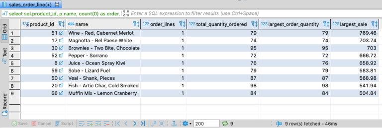
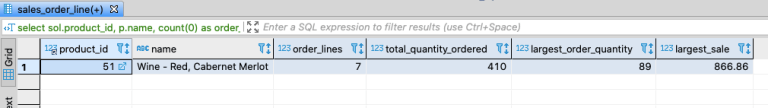

Next in the SQL for the uninterested series, we’ll take a dive into aggregating your data, using some group by clauses.
We’re still using the [sample database](sql-for-the-uninterested) available via the docker
images from the first post in this series. The simplest aggregate query would be to get a count of the number of rows in a given
table.  We’ll start with a query to count the number of rows in the sales order table.
```sql
select count(0)
  from sales_order;
```
You should get a result of 502.  You can also incorporate the joins we covered in the last post.  To count the number of records
in the sales order table joined to the sales order line table you could write:
```sql
select count(0)
  from sales_order as so
  join sales_order_line as sol on sol.sales_order_id = so.sales_order_id;
```
You should get a result of 762.  So why we counting zero?  The count function counts rows which contain non-null values. By
counting a constant you’ll always have a non-null value, so you’ll always get a count of rows in the result set without having
to think about which columns can or cannot contain nulls, or even having to spend any time at all thinking about which column
can be counted. For me, it clearly conveys it’s a simple row count and nothing more; your count has nothing to do the data in
some field being counted.  You could also use count(*).  If you ran the same query using count(null), you’d get a result of zero.
You could just as well run a count on a primary key field, where you know there are no nulls, and get the same result. Just to
try that all out, run the following.
```sql
select count(null),
       count(0),
       count(*),
       count(so.sales_order_id)
  from sales_order as so
  join sales_order_line as sol on sol.sales_order_id = so.sales_order_id;
```
The first column will return zero, while the other three have a value of 762.  Next let’s do some counts on a column that
contains some data and some nulls. In the query below, you’ll see that of the 762 sales order lines in the join, 50 of them
have special instructions.
```sql
select count(0),
       count(sol.special_instructions)
  from sales_order as so
  join sales_order_line as sol on sol.sales_order_id = so.sales_order_id;
```
Next, let’s look at the DISTINCT keyword. Using that, you can get a count of unique values in a column. For example, in the
following query you’ll find that of the 762 sales order lines, there are 111 unique products ordered.
```sql
select count(sol.product_id),
       count(DISTINCT sol.product_id)
  from sales_order as so
  join sales_order_line as sol on sol.sales_order_id = so.sales_order_id;
```
So what if you wanted to know how many order lines there were for each of those 111 products, what was the total amount ordered
for each product, and maybe some information about sales figures? In this next query, we’ll add a group by clause to fetch that
data. When using a group by clause, any column in your select statement that is not an aggregate must be included in the group
by clause. Let’s also look at a few additional aggregate functions in this query.
```sql
select sol.product_id,
        p.name,
        count(0) as order_lines,
        sum(sol.order_quantity) as total_quantity_ordered,
        max(sol.order_quantity) as largest_order_quantity,
        max(sol.order_quantity * sol.unit_price) as largest_sale
   from sales_order as so
   join sales_order_line as sol on sol.sales_order_id = so.sales_order_id
   join product as p on p.product_id = sol.product_id
  group by sol.product_id,
        p.name;
```
We joined to the product table as well so that the results included the product name. We can add an order by clause as well.
Perhaps we want to sort by largest to smallest total sales prices.
```sql
select sol.product_id,
        p.name,
        count(0) as order_lines,
        sum(sol.order_quantity) as total_quantity_ordered,
        max(sol.order_quantity) as largest_order_quantity,
        max(sol.order_quantity * sol.unit_price) as largest_sale
   from sales_order as so
   join sales_order_line as sol on sol.sales_order_id = so.sales_order_id
   join product as p on p.product_id = sol.product_id
  group by sol.product_id,
        p.name
  order by largest_sale desc;
```
Now what if we wanted to include only sales over $500? Can we add something like where largest_sale > 500 to the query? Since
largest_sale is an aggregate column, we cannot. We’d get an error like “Unknown column ‘largest_sale’ in ‘where clause’.” To
add a filter on an aggregate column, you have to add a ‘having’ clause, like so.
```sql
select sol.product_id,
        p.name,
        count(0) as order_lines,
        sum(sol.order_quantity) as total_quantity_ordered,
        max(sol.order_quantity) as largest_order_quantity,
        max(sol.order_quantity * sol.unit_price) as largest_sale
   from sales_order as so
   join sales_order_line as sol on sol.sales_order_id = so.sales_order_id
   join product as p on p.product_id = sol.product_id
  group by sol.product_id,
        p.name
 having largest_sale > 500
  order by largest_sale desc;
```
You could add a where clause to filter non-aggregate data. Say that we wanted only products that totaled over $500 in sales to
North Carolina. We can join to the address table and add a where clause like so.
```sql
select sol.product_id,
        p.name,
        count(0) as order_lines,
        sum(sol.order_quantity) as total_quantity_ordered,
        max(sol.order_quantity) as largest_order_quantity,
        max(sol.order_quantity * sol.unit_price) as largest_sale
   from sales_order as so
   join sales_order_line as sol on sol.sales_order_id = so.sales_order_id
   join product as p on p.product_id = sol.product_id
   join address on address.address_id = so.ship_to_address_id
  where address.state_province = 'NC'
  group by sol.product_id,
        p.name
 having largest_sale > 500
  order by largest_sale desc;
```


If we took a look at just product ID 51 nation-wide and compared it to the results above, we see that just one of the seven
order lines nationwide had a ship-to address in North Carolina.
```sql
select sol.product_id,
        p.name,
        count(0) as order_lines,
        sum(sol.order_quantity) as total_quantity_ordered,
        max(sol.order_quantity) as largest_order_quantity,
        max(sol.order_quantity * sol.unit_price) as largest_sale
   from sales_order as so
   join sales_order_line as sol on sol.sales_order_id = so.sales_order_id
   join product as p on p.product_id = sol.product_id
   join address on address.address_id = so.ship_to_address_id
  where sol.product_id = 51
  group by sol.product_id,
        p.name
 having largest_sale > 500
```

<figcaption align="center">

*Sales for product ID 51 nationwide*

</figcaption>
Note that the order of the clauses in your query is a matter of valid syntax. Your select clause must come first, followed by
your from and any joins. If you are using a where clause for any non-aggregate column filtering, those must come next. Group by
clauses and any having clauses must come next. And finally, if you are using any order by clauses, they must come at the end.

## Up Next

Remaining to cover in a quick sql by example format of the basics are inserts, updates, and deletes, as well as subqueries and
unions. I’ll be covering those in some upcoming posts.