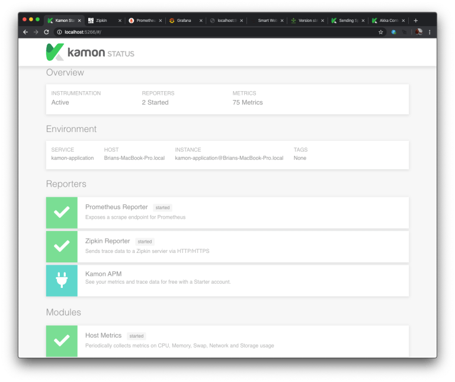
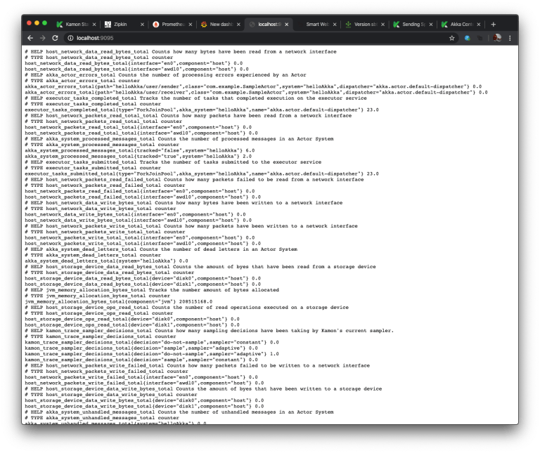
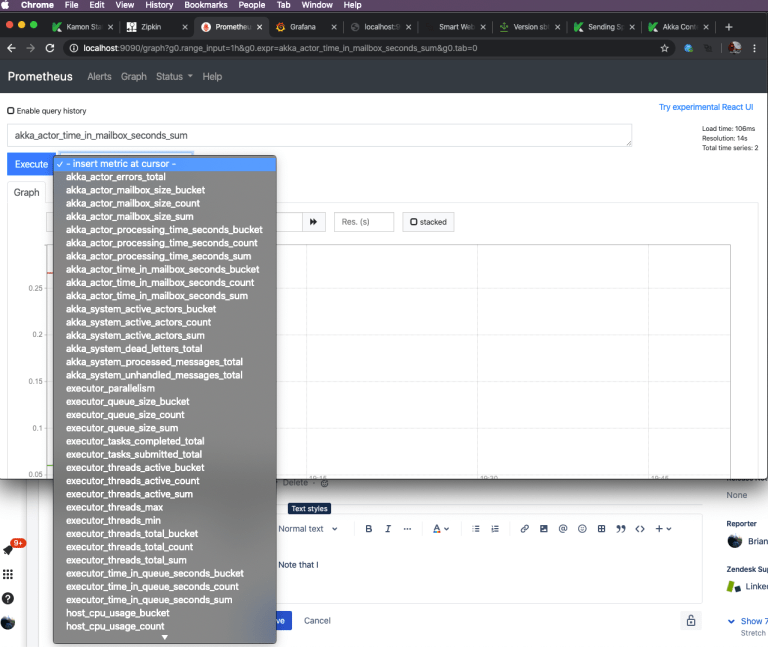
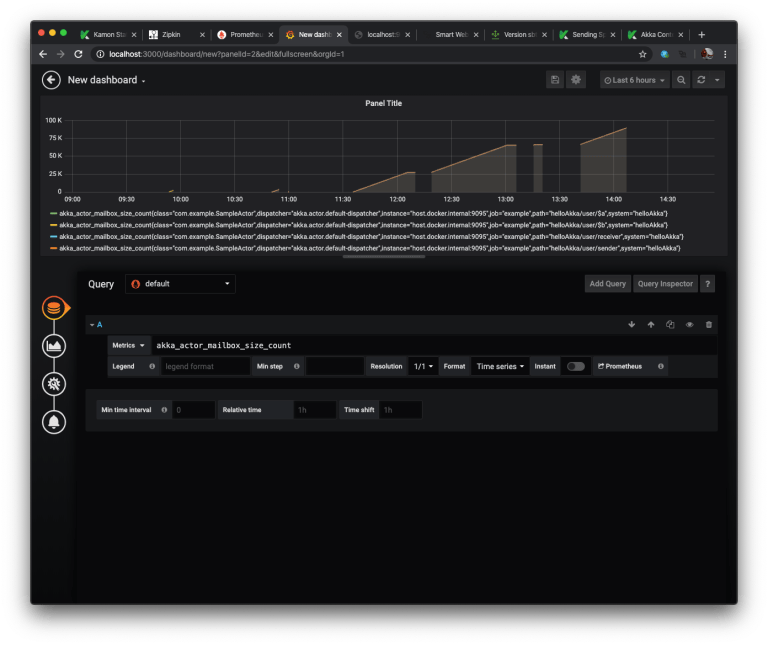
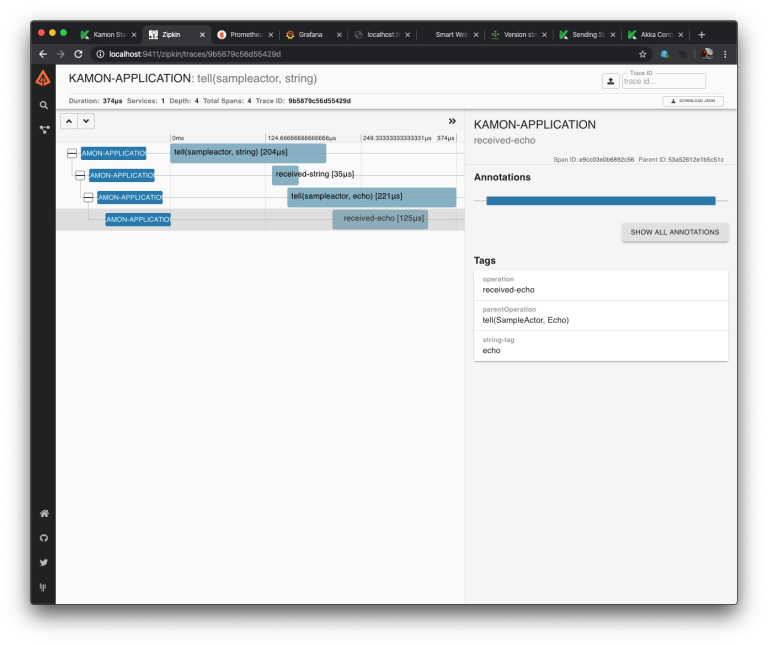

Recently I included Kamon’s instrumentation tools into an Akka project. I posted the sample project on
[github](https://github.com/dumpsterfireproject/kamon-sample). I’ll do a quick walk through of the process in this post along
with my initial impressions of Kamon.

I started with the documentation in Kamon’s [plain application installation guide](https://kamon.io/docs/latest/guides/installation/plain-application/).
I added the latest Kamon bundle in my build.sbt. This includes all the instrumentation available in Kamon.

```
libraryDependencies += "io.kamon" %% "kamon-bundle" % "2.0.6"
```

Since I used SBT, next I installed the SBT plugin as the installation guide recommended (in plugins.sbt).

```
addSbtPlugin("io.kamon" % "sbt-kanela-runner" % "2.0.6")
```

I created a sample application with two actors that send messages to each other and initialized Kamon at the beginning of
application launch.

```scala
package com.example
 
import akka.actor.ActorSystem
import kamon.Kamon
import scala.concurrent.duration._

object Main extends App {
  Kamon.init()
  val actorSystem: ActorSystem = ActorSystem.create("helloAkka")
  import actorSystem.dispatcher
  val receiver = actorSystem.actorOf(SampleActor.props, "receiver")
  val sender = actorSystem.actorOf(SampleActor.props, "sender")
  actorSystem.scheduler.schedule(1.seconds, 10.seconds) { receiver.tell("Hello", sender) }
}
package com.example

import akka.actor.{Actor, ActorLogging, Props}
import kamon.Kamon
import kamon.trace.Span

object SampleActor {
  def props: Props = Props(new SampleActor())
  case class Echo(s: String)
}

class SampleActor() extends Actor with ActorLogging {
  def receive: Receive = {
    case SampleActor.Echo(s) => log.info("received {}", s)
    case s: String =>
      val origin = sender()
      origin ! SampleActor.Echo(s)
  }
}
```

Next I added the [Prometheus](https://prometheus.io/docs/introduction/overview/) metrics reporter and
[Zipkin](https://zipkin.io/) spans reporter. Other options included using InfluxDB as your metrics reporter instead of
Prometheus, and Jaeger instead of Zipkin. Additionally, there is the option of using a combined reporter like Kamon’s APM
or Datadog, rather than separate metrics and spans reporters. For my initial trial, I just went with Prometheus and Zipkin.
I added those to my build.sbt.

```
libraryDependencies += "io.kamon" %% "kamon-prometheus" % "2.0.1"
libraryDependencies += "io.kamon" %% "kamon-zipkin" % "2.0.1"
```

I set up a docker-compose file to provide the Prometheus and Zipkin services. Kamon will push the span data to Zipkin, but
Prometheus scrapes the data from Kamon. Since I was using Docker desktop and Prometheus was running in a container, while my
application was running on my host system, I configured Prometheus to scrape from host.docker.internal:9095. I also included
[Grafana](https://grafana.com/grafana/) to create some really nice graphs from the data gathered by Prometheus.

```
version: "3"

services:
  prometheus:
    image: prom/prometheus
    volumes:
      - "./prometheus.yml:/etc/prometheus/prometheus.yml"
    ports:
      - "9090:9090"
  zipkin:
    image: openzipkin/zipkin
    ports:
      - "9411:9411"
  grafana:
    image: grafana/grafana
    ports:
      - "3000:3000"
```

The prometheus.yml file looked like this:

```
scrape_configs:
  - job_name: example
    scrape_interval: 5s
    static_configs:
      - targets:
          - host.docker.internal:9095
```

I created an application.conf file in my resource directory to configure the Kamon instrumentation. In a production application,
you would not want to use the wildcard operators to include all actors, especially with start-trace configuration. Since my
sample application is small and it purpose was to explore Kamon, I left it pretty wide open.

```
kamon.instrumentation.akka.filters {
  actors.track {
    includes = [ "helloAkka/user/**" ]
  }
  actors.trace {
    includes = [ "helloAkka/user/**" ]
  }
  actors.start-trace {
    includes = [ "helloAkka/user/**" ]
  }
}

kanela {
  log-level = "DEBUG"
}
```

I also wanted to explore having the Kamon’s context information included in my application’s logging. So I included Kamon’s
conversion rules in my logback.xml and added the trace ID and span ID to my log messages.

```
<configuration debug="false">
    <conversionRule conversionWord="traceID" converterClass="kamon.instrumentation.logback.tools.TraceIDConverter" />
    <conversionRule conversionWord="spanID" converterClass="kamon.instrumentation.logback.tools.SpanIDConverter" />
    <conversionRule conversionWord="contextTag" converterClass="kamon.instrumentation.logback.tools.ContextTagConverter" />

    <conversionRule conversionWord="contextEntry" converterClass="kamon.instrumentation.logback.tools.ContextEntryConverter" />

    <appender name="STDOUT" class="ch.qos.logback.core.ConsoleAppender">
        <encoder>
            <pattern>[%date{ISO8601}] [%level] [%logger] [%marker] [%thread] [%traceID] [%spanID] - %msg {%mdc}%n</pattern>
        </encoder>
    </appender>

    <appender name="ASYNC" class="ch.qos.logback.classic.AsyncAppender">
        <queueSize>8192</queueSize>
        <neverBlock>true</neverBlock>
        <appender-ref ref="STDOUT" />
    </appender>

    <root level="INFO">
        <appender-ref ref="ASYNC" />
    </root>
</configuration>
```

I also wanted to explore adding tags to my spans, so I updated my SampleActors to include some tags.

```scala
class SampleActor() extends Actor with ActorLogging {

  def receive: Receive = {
    case SampleActor.Echo(s) =>
      val span: Span = Kamon.spanBuilder("received-echo").tag("string-tag", "echo").start()
      Kamon.runWithSpan(span, true) {
        log.info("received {}", s)
      }

    case s: String =>
      val span: Span = Kamon.spanBuilder("received-string").tag("string-tag", "hello").start()
      Kamon.runWithSpan(span, true) {
        val origin = sender()
        origin ! SampleActor.Echo(s)
      }
  }
}
```

Finally, I was ready to run my application. I started it using sbt run from the command line. Then in my browser I went to
localhost:5266 to view the Kamon status page (the default port for the status page) and validated Kamon was running and the
reporters were started.



<figcaption align="center">

*Kamon Status Page*

</figcaption>

I was able to navigate to the default port that Kamon has available for Prometheus to scrape data and validate that data were
indeed available. It took a few seconds until there were data available, but eventually I could see the data.



<figcaption align="center">

*Kamon Metrics Data*

</figcaption>

Next I went to my Prometheus service at localhost:9090 to view the data. There were quite a few metrics available.



<figcaption align="center">

*Kamon Metrics Available in Prometheus*

</figcaption>

Next I went to my Grafana service on localhost:3000, created a login, and then configured it to point to the Prometheus service.
I then has some really nice graphs of my metrics data.



<figcaption align="center">

*Displaying Metrics in Grafana*

</figcaption>

Last, I went to my Zipkin service at localhost:9411 and was able to see spans the the messages being sent in my application. I
could drill down into the details of each span.



<figcaption align="center">

*Span Data in Zipkin*

</figcaption>

My overall impressions were that the setup was pretty easy, and provided a lot of information rather quickly. As some follow-up
work, I next want to start exploring the Kamon instrumentation available for Akka HTTP. It is included in the Kamon bundle, I
should just need to add the configuration to my application.conf file. Likewise, there are JDBC metrics included in the bundle.
These include metrics on a Hikari JDBC connection pool, as well as statement tracing. Though there is much included in the
bundle, there is the option of installing only the instrumentation that you need.
