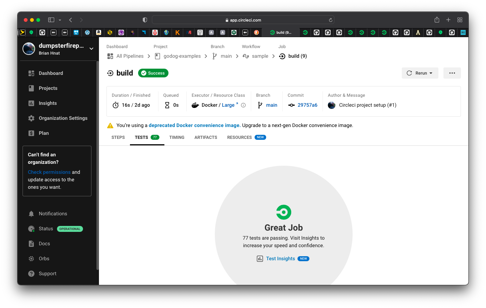
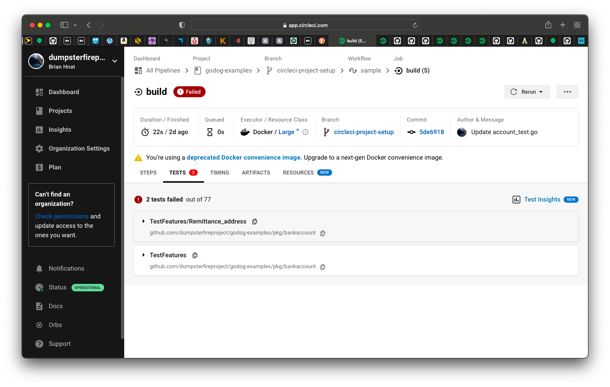
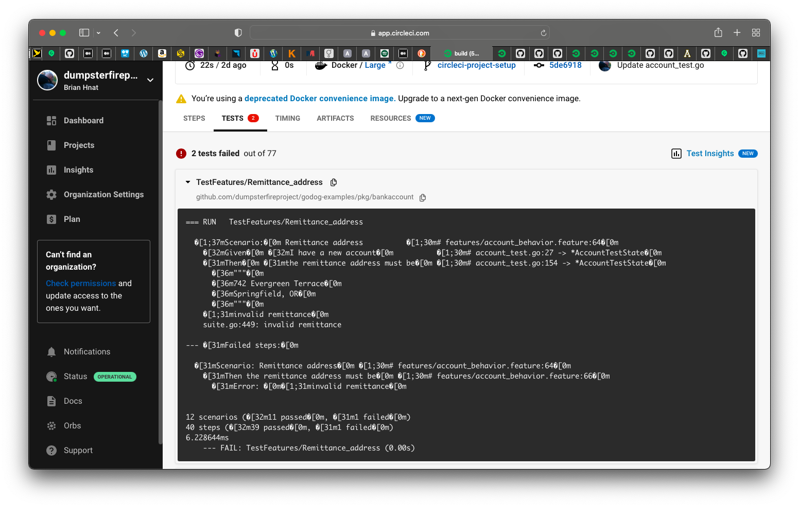
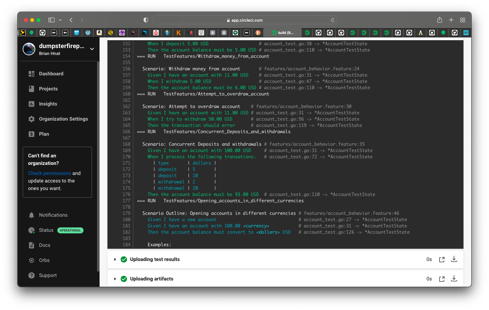
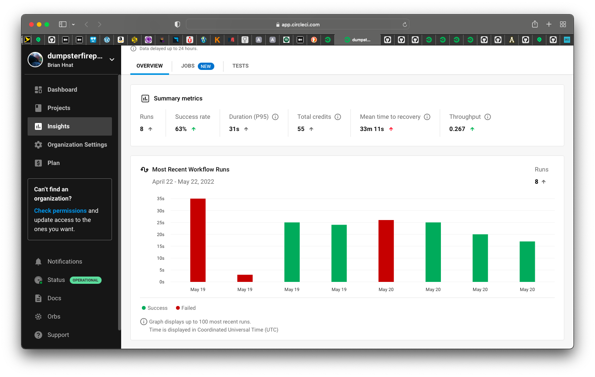
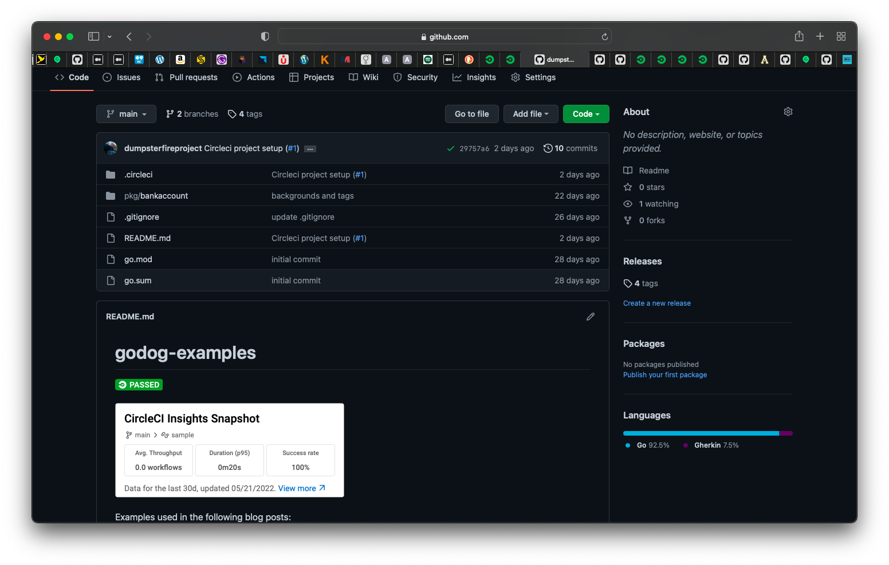

One last piece to discuss in this series on using Cucumber and Godog is reporting. When you've collaborated with your
users and created a great suite of features to test the behavior of your system, you're likely not going to be only
running your features from your favorite IDE or the command line all the time. You'll have some sort of CI/CD pipeline
to deploy your new functionality regularly. As part of that pipeline in addition to your unit tests, you'll be running 
your features to validate your new functionality behaves as expected and none of the previously working functionality 
was broken. In the event that a test fails, you'll want to be able to see in your pipeline which test or tests have failed.
You'll want to see that quickly and easily without having to rely solely on digging through logs. You'll also be interested
in trends over time. As your product grows and your number of tests grow, you'll want to be able to see how stable your
test suite is.  Do you have any flaky tests? Are there any tests that are taking a long time to run and are preventing 
the fast feedback you want when deploying changes.

Godog supports multiple formatters of test output. These options include "pretty", which will write to the console in nicely
formatted, human readable output. It also includes "junit", which will output an XML file with your test result data formatted
in the junit standard. There is also the cucumber options, which outputs json to a file with your cucumber test results, as
well as the events option which also outputs test results as json. You can also use multiple formatters when running your test.
This is done by using a comma separated list of formatters. This will allow to you do something like write test data to
a file as junit/xml for reporting, while also using the pretty formatter for your log files.

You can publish your test data to a reporting service, such as the [Cucumber Reports Service](https://reports.cucumber.io/) or
[reportportal.io](https://reportportal.io). Your CI/CD pipeline will also likely have some test reporting functionality
that will allow you to monitor and track your tests over time as you continue to deploy changes to your application.
For the remainder of this discussion, I'm going to work with an example using [CircleCI](https://circleci.com) and the junit format.

Briefly, your pipeline in circleci is defined in a .circleci/config.yml file in your project. For a Go project, circleci 
will recommend using gotestsum, which is essentially a wrapper for the `go test` command. In my example below, I am
using the --junit flag to output the test results as XML in the junit format and store the results to a file. I am
also using the `--format standard-verbose` flag to have my feature results output to the log files nicely. Finally, I am
adding the `-- -coverprofile=cover.out` flag to measure my code coverage. In circlecli, by using the store_test_results option, the junit results will be available in the "tests" tab for your job, as well as the Insights section. The test
coverage reports can be saved and made available for viewing by utilizing the store_artifacts option.

```yml
      - run:
          name: Run tests
          command: |
            mkdir -p /tmp/test-reports
            mkdir -p /tmp/artifacts
            gotestsum --junitfile /tmp/test-reports/unit-tests.xml --format standard-verbose -- -coverprofile=cover.out ./...
            go tool cover -html=cover.out -o coverage.html
            mv coverage.html /tmp/artifacts
      - store_test_results:
          path: /tmp/test-reports
      - store_artifacts:
          path: /tmp/artifacts
```

I don't have anything that enforces a particular percent code coverage. I rather like the philosophy on code coverage
described in [this post on artima.com](https://www.artima.com/weblogs/viewpost.jsp?thread=204677):

> Early one morning, a programmer asked the great master:
>
> "I am ready to write some unit tests. What code coverage should I aim for?"
> The great master replied:
>
> "Don’t worry about coverage, just write some good tests."
> The programmer smiled, bowed, and left.
> 
> ...
> 
> Later that day, a second programmer asked the same question.
> 
> The great master pointed at a pot of boiling water and said:
> 
> "How many grains of rice should put in that pot?"
> The programmer, looking puzzled, replied:
> 
> "How can I possibly tell you? It depends on how many people you need to feed, how hungry they are, what other food you are serving, how much rice you have available, and so on."
> "Exactly," said the great master.
> 
> The second programmer smiled, bowed, and left.
> 
> ...
> 
> Toward the end of the day, a third programmer came and asked the same question about code coverage.
> 
> "Eighty percent and no less!" Replied the master in a stern voice, pounding his fist on the table.
> The third programmer smiled, bowed, and left.
> 
> ...
> 
> After this last reply, a young apprentice approached the great master:
> 
> "Great master, today I overheard you answer the same question about code coverage with three different answers. Why?"
> The great master stood up from his chair:
> 
> "Come get some fresh tea with me and let’s talk about it."
> After they filled their cups with smoking hot green tea, the great master began to answer:
> 
> "The first programmer is new and just getting started with testing. Right now he has a lot of code and no tests. He has a long way to go; focusing on code coverage at this time would be depressing and quite useless. He’s better off just getting used to writing and running some tests. He can worry about coverage later."
> 
> "The second programmer, on the other hand, is quite experience both at programming and testing. When I replied by asking her how many grains of rice I should put in a pot, I helped her realize that the amount of testing necessary depends on a number of factors, and she knows those factors better than I do – it’s her code after all. There is no single, simple, answer, and she’s smart enough to handle the truth and work with that."
> 
> "I see," said the young apprentice, "but if there is no single simple answer, then why did you answer the third programmer ‘Eighty percent and no less’?"
> 
> The great master laughed so hard and loud that his belly, evidence that he drank more than just green tea, flopped up and down.
> 
> "The third programmer wants only simple answers – even when there are no simple answers … and then does not follow them anyway."
> The young apprentice and the grizzled great master finished drinking their tea in contemplative silence.


Some samples from my configuration are as follows.

The test tab for a passing test:


The test tab for a failing test:


The test tab for a failing test, details expanded:


The feature pretty output from the logs:


The Insights page in circlecli:


The badges from my test results added to my github repository:


One final note - there is an option of building your own custom formatter in Godog. I have not tried implementing one as of this time. But an example can be found in the Godog project repository at https://github.com/cucumber/godog/tree/main/_examples/custom-formatter.

Well, that wraps up this quick introduction to reporting with cucumber and Godog. I hope it has been helpful and serves
as a good starting point for you. Until next time!
