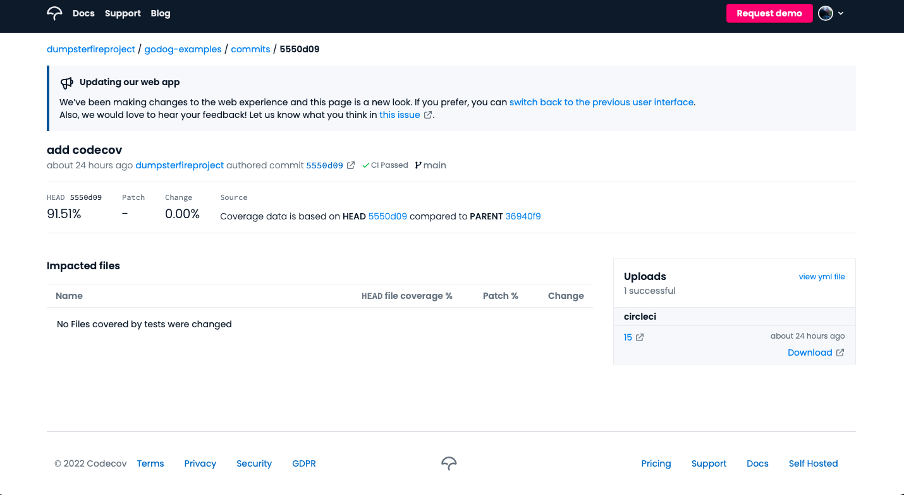
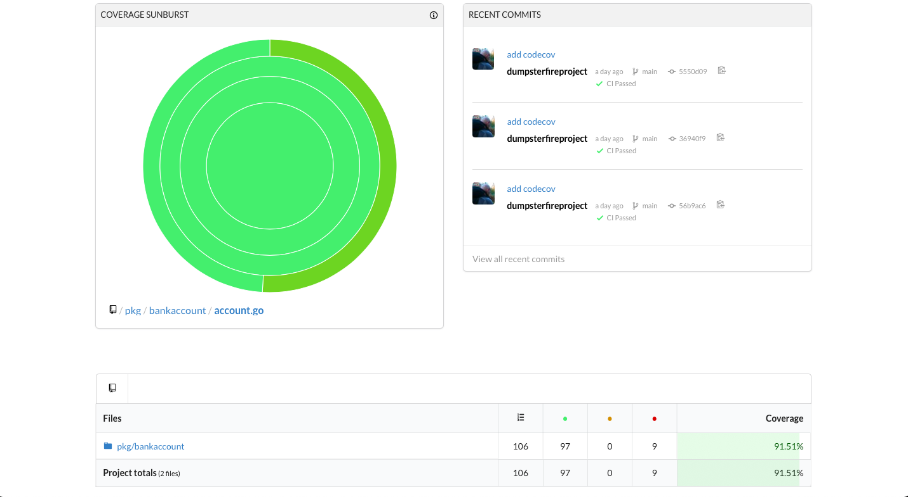
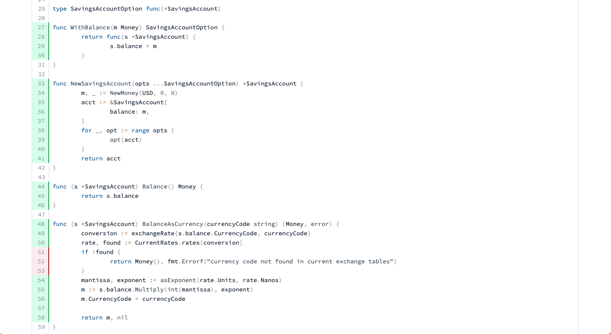
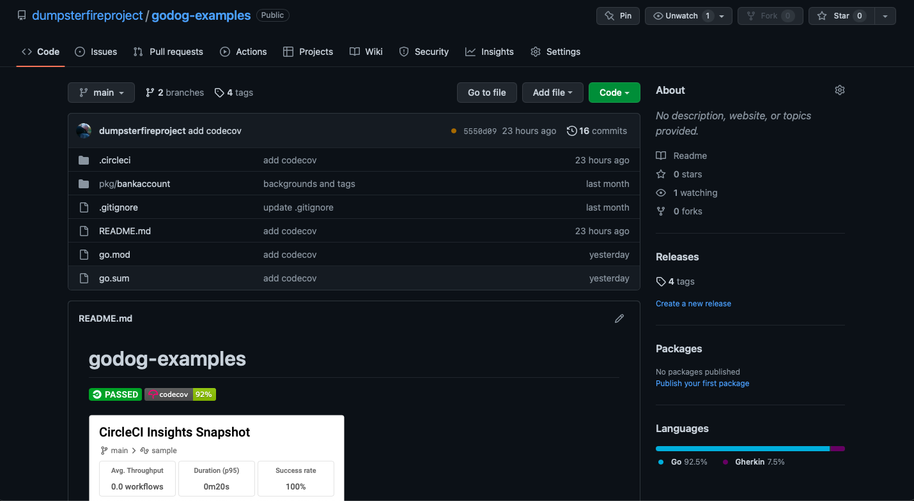

In the [last post](https://thedumpsterfireproject.com/godog-part-6), I put together an example of utilizing
a CI/CD tool like [CircleCI](https://circleci.com) to run your tests when new code is committed and provided
an example of seeting up some basic test and code coverage reporting. In this post, I'll walk you through
updating your CircleCI configuration to incorporate some more robust code coverage reporting using 
[Codecov](https://about.codecov.io).

Since I'm already using Github, integration with CircleCI will be pretty simple. The quick start is available
at https://docs.codecov.com/docs. I created my account with CircleCI using my Github credentials. Next, I needed
to request access as an admin to authorize Codecov as a third-party application in my organization's settings
page in Github, available at https://github.com/organizations/[YOUR_ORG_NAME]/settings/oauth_application_policy.
Once linked, Codecov will automatically sync your repositories.

Next, I had to update my CircleCI config. Codecov's [supported formats](https://docs.codecov.com/docs/supported-report-formats)
include Cobertura XML, which is the option I initially chose. Listed among their supported formats are Golang txt,
which I plan on trying out next. In my config.yml, I needed to add the codecov/codecov@3.2.2 orb. I then
added a step in my build job to install github.com/boumenot/gocover-cobertura so I could generate the Cobertura XML
file. After my tests were run, I executed `gocover-cobertura < cover.out > /tmp/artifacts/coverage.xml` and then
included a codecov/upload step to upload the xml file to Codecov. After that, when I committed and pushed to Github
and my next CircleCI build was triggered, the code coverage metrics were uploaded to Codecov. The updated
CircleCI config is below.

```yaml
version: 2.1

orbs:
  codecov: codecov/codecov@3.2.2

# Define a job to be invoked later in a workflow.
# See: https://circleci.com/docs/2.0/configuration-reference/#jobs
jobs:
  build:
    working_directory: ~/repo
    # Specify the execution environment. You can specify an image from Dockerhub or use one of our Convenience Images from CircleCI's Developer Hub.
    # See: https://circleci.com/docs/2.0/configuration-reference/#docker-machine-macos-windows-executor
    docker:
      - image: circleci/golang:1.17
    # Add steps to the job
    # See: https://circleci.com/docs/2.0/configuration-reference/#steps
    steps:
      - checkout
      - restore_cache:
          keys:
            - go-mod-v4-{{ checksum "go.sum" }}
      - run:
          name: Install Dependencies
          command: go mod download
      - run:
          name: Install gocover
          command: go install -v github.com/boumenot/gocover-cobertura
      - save_cache:
          key: go-mod-v4-{{ checksum "go.sum" }}
          paths:
            - "/go/pkg/mod"
      - run:
          name: Run tests
          command: |
            mkdir -p /tmp/test-reports
            mkdir -p /tmp/artifacts
            gotestsum --junitfile /tmp/test-reports/unit-tests.xml --format standard-verbose -- -coverprofile=cover.out -covermode count ./...
            go tool cover -html=cover.out -o coverage.html
            mv coverage.html /tmp/artifacts
            gocover-cobertura < cover.out > /tmp/artifacts/coverage.xml
      - store_test_results:
          path: /tmp/test-reports
      - store_artifacts:
          path: /tmp/artifacts
      - codecov/upload:
          file: /tmp/artifacts/coverage.xml
```

I was then able to view my code coverage data in Codecov. It included summary data for that build. It also
included some really useful charts that showed a breakdown of coverage by packge. Lastly, it also allowed
my to drill down into the details and see which lines of my code were and were not covered.

Summary Data:


Charts:


Detailed Data by Line:


The last thing I did was to [add a badge](https://docs.codecov.com/docs/status-badges) for code coverage to
my git repository.  In my readme file, I just need to add a link like:
```markdown
[](https://codecov.io/github/dumpsterfireproject/godog-examples)
```



There is a lot more functionality in Codecov that I plan to explore. But I was glad that it was so simple to
at least get started. There is a list of common configurations for Codecov available at https://docs.codecov.com/docs/common-recipe-list.
As I mentioned in my last post, I'm not really a fan of enforcing a specific requirement for code coverage.
But I am interested in the ability to make sure that you're moving the needle in the right direction and making
sure that coverage is increased with each PR.

```yaml
coverage:
  status:
    project:
      default:
        target: auto  # auto compares coverage to the previous base commit
```

I also like that you can configure that to allow for some tolerance:

```yaml
coverage:
  status:
    project:
      default:
        target: auto
        # adjust accordingly based on how flaky your tests are
        # this allows a 10% drop from the previous base commit coverage
        threshold: 10%
```

Well, that's about it for now.  Until next time!
