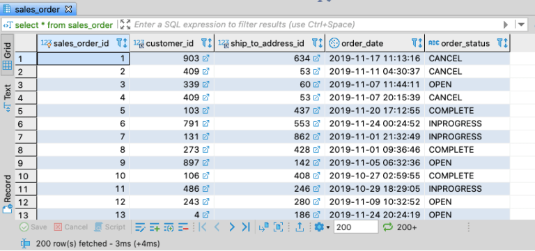
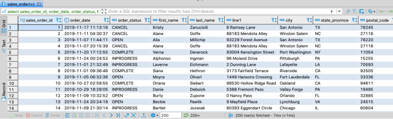
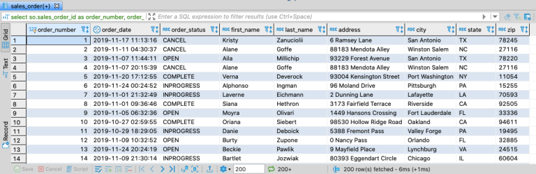
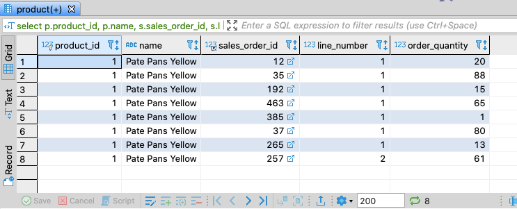
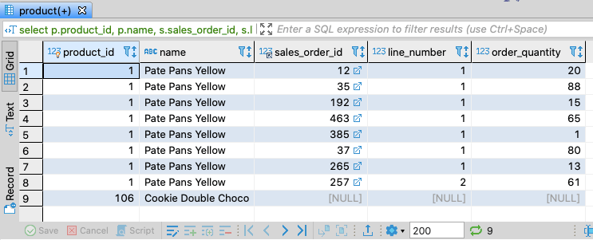
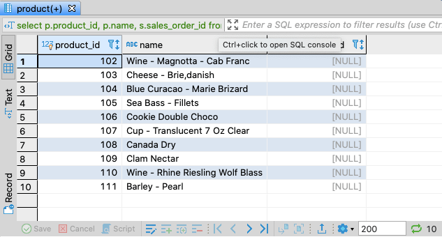

Continuing with the “SQL for the Uninterested” posts, let’s talk about joining two or more tables together to produce a single
result set. There are 4 kinds of joins. To discuss these, let’s use the customer and address tables from our [sample database](../sql-for-the-uninterested).

## Join (aka Inner Join)

Let’s start with our sales order data, writing a simple query.
```sql
select *
  from sales_order;
```

<figcaption align="center">

*Data from the sales_order table*

</figcaption>

Now what if we wanted to view the customer or address details? We can join to the customer and address table and create a result set which includes all the data we need.

```sql
select sales_order_id,
       order_date,
       order_status,
       first_name,
       last_name,
       line1,
       city,
       state_province,
       postal_code
  from sales_order
  join customer on customer.customer_id = sales_order.customer_id
  join address on address.address_id = sales_order.ship_to_address_id
```

<figcaption align="center">

*Sales orders with customer and shipping addresses*

</figcaption>

Now, I mentioned in the last post that I’m not going to get into a much discussion of database theory, but rather stick to hands-on examples to learn some basic SQL. But this might be a good time for a quick discussion of why would we even want to have separate customer and address tables anyway? Usually you want to keep your relational data “normalized.” That is, keep your data structured so that you avoid redundancy and improve data integrity. By normalizing the data, when a customer places an order to be shipped to a specific address, and then places subsequent orders to be shipped to the same address, we reduce the chances that the addresses of all those orders are inconsistent by reusing the same address data from the address table. If the address was entered incorrectly in the first place, we need only update one address record instead of having to find all the orders to update if the data were not normalized. If we needed to delete all orders shipped to a specific address, we reduce the chance for error when we delete orders with a specific ship-to-address ID rather than trying to figure out how to delete the data by address line, city, state, etc. Looking at our schema in the sample database, there are opportunities for further normalize the data. For instance, we could create separate tables for state/province or postal codes, so we maintain a list of valid values. Then any addresses that get created would always have valid values for those fields. As the address table exists currently, there is really nothing to check on the data integrity, and you can enter whatever string you want for state/province or postal code, whether it’s a valid value or not.

When joining tables, commonly you’ll alias a column or table. Sometimes you use an alias on a column name to disambiguate or improve readability. Sometimes you use an alias on a table name for brevity. An example of the same query from above using aliases is as follows. Note that once you alias a table name in a query, you must use that alias rather than the actual table name in the rest of your query.

```sql
select so.sales_order_id as order_number,
        order_date,
        order_status,
        first_name,
        last_name,
        line1 as address,
        city,
        state_province as state,
        postal_code as zip
   from sales_order as so
   join customer as c on c.customer_id = so.customer_id
   join address as a on a.address_id = so.ship_to_address_id
```

<figcaption align="center">

*Results after aliasing some columns*

</figcaption>

## Left Join (aka Left Outer Join)

When doing an inner join above, our result set contained data from the sales_order and customer table where they shared a customer_id, and from the sales_order and address table where the shared address IDs. But what happens to data from one table where there is no matching data in the other table? Let’s start by running this query.

select product_id,
       name
  from product
 where product_id in (1, 106);
You’ll see records for product_id 1, Pate Pans Yellow, and product_id 106, Cookie Double Choco. Now let’s do an inner join to the sales_order_line table to find orders for those two products.

```sql
select p.product_id,
        p.name,
        s.sales_order_id,
        s.line_number,
        s.order_quantity
   from product as p
   join sales_order_line as s on s.product_id = p.product_id
  where p.product_id in (1, 106);
```

<figcaption align="center">

*Sales order lines for given products*

</figcaption>

That query returns no rows for Cookie Double Choco. If we wanted to list that product in my result set, regardless of whether there were orders or not, that’s our use case for left joins, sometimes referred to as outer joins or left outer joins. Here’s what that query would look like.

```sql
 select p.product_id,
        p.name,
        s.sales_order_id,
        s.line_number,
        s.order_quantity
   from product as p
   left join sales_order_line as s on s.product_id = p.product_id
  where p.product_id in (1, 106);
```

<figcaption align="center">

*Left outer join results*

</figcaption>
In this query, the product table is sometimes referred to as the driving table. Left joins are when you want all the data from your driving table, regardless of whether or not there are matching records in the other table(s). One other thing to note is that once a table is left joined in your query, the other tables that is it joined to must also be left joined. For example, run the following two queries and compare the results.

```sql
select p.product_id,
        p.name,
        s.sales_order_id,
        s.line_number,
        s.order_quantity
   from product as p
   left join sales_order_line as s on s.product_id = p.product_id
        join sales_order as so on so.sales_order_id = s.sales_order_id
  where p.product_id in (1, 106);
```
```sql
select p.product_id,
        p.name,
        s.sales_order_id,
        s.line_number,
        s.order_quantity
   from product as p
   left join sales_order_line as s on s.product_id = p.product_id
   left join sales_order as so on so.sales_order_id = s.sales_order_id
  where p.product_id in (1, 106);
```
Note that in the first query, 8 rows are returned. The Cookie Double Choco row drops out again, even though we left joined to the sales_order_line table. When we also left join to the sales_order table in the second query, now we have 9 rows returns and keep the Cookie Double Choco row in the result set. Note that in any outer join, where there are now rows to provide the data for the fields of a given row, the values returned for those fields will be null. That can be useful to return only rows where there are no matches. For instance, if I wanted to return any product for which there were no orders, I could write the following query.
```sql
select p.product_id,
        p.name,
        s.sales_order_id
   from product as p
   left join sales_order_line as s on s.product_id = p.product_id
  where s.sales_order_id is null;
```

<figcaption align="center">

*Product with no orders*

</figcaption>

## Right Joins and Full Outer Joins

In all honestly, I really never use these join types. But just to cover them briefly, the right join is similar to the left join, except all the rows are returned for the second table rather than the first. In the full join, all rows from both tables are returned.

## Up Next

Now that we know how to do joins and outer joins, in the next post, we’ll be able to start to adding some group by clauses and aggregate functions to create some interesting summary results.