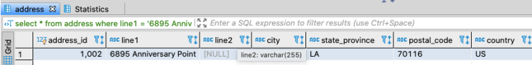

Using the database from the first in the [SQL for the uninterested series](sql-for-the-uninterested), in this post we'll cover
inserts, updates and deletes.
We'll start with inserts of single rows, multiple rows, and inserts using subqueries. Then we'll look at basic updates and
performing multiple updates in a single transaction. Finally, we'll cover deleting rows.

## Inserts

The basic format for inserts is:
```sql
insert into ( &lt;list of non autogenerated columns&gt; )
  values ( &lt;list of values to be inserted&gt; );
```
Using the address table for our examples, if we could run the following
```sql
insert into address (line1, city, state_province, postal_code, country)
 values ('89 Karstens Parkway', 'Atlanta', 'GA', '30323', 'US');
```
The address.address_id column is defined as auto-increment, so we do not include that; the database will generate that value for
us. The address.line2 column will default to null. Alternatively, we could exclude the list of column names, provided that the
list of values has the correct number, types, and order that will produce a valid row. For example, in the following insert we
must include a value for the address_id and line2 or else we will receive an error like, "Column count doesn't match value count
at row 1." In this particular case, since address_id is set to auto-increment we can use null in our insert statement and the
database will automatically generate the next number for the value for that field.
```sql
insert into address
 values (null, '6895 Anniversary Point', null, 'New Orleans', 'LA', '70116', 'US');
select *
  from address
 where line1 = '6895 Anniversary Point';
```


Inserting multiple rows at once is similar. Two reasons for inserting multiple rows in one insert statement as opposed to
running multiple insert statement are first, that all the rows being inserted in a single statement succeed or fail atomically.
If you had 10 rows to insert and you wanted them all to succeed or none to succeed, doing the inserts in a single transaction
would be a good idea. Secondly, unless you're dealing with very large batches, inserting multiple rows in a single statement is
going to be more performant than running multiple inserts. If you're developing a web application and your application makes 100
individual round trips to the database to execute 100 individual insert statements, your application may seem noticeably more
laggy as opposed to making one round trip to the database to execute 1 insert statement with 100 rows. An example would be as
follows.
```sql
insert into address
     (line1, city, state_province, postal_code, country)
   values
     ('86761 Thackeray Circle', 'Buffalo', 'NY', '14276', 'United States'),
     ('46 Mayfield Alley', 'Huntsville', 'AL', '35810', 'United States'),
     ('9 Boyd Parkway', 'Cincinnati', 'OH', '45296', 'United States'),
     ('87 Dennis Alley', 'New York City', 'NY', '10155', 'United States');
```
You can also insert multiple rows utilizing data that already exists in table in the database. In the following two examples,
the first one will create 10 new sales orders based on data from the customer table. The second example will data from existing
orders into new orders for the given customer.
```sql
insert into sales_order
  (customer_id, ship_to_address_id, order_date, order_status)
  select customer_id, customer_address_id, now(), 'OPEN'
    from customer
   where customer_id BETWEEN 1 and 10;

insert into sales_order
  (customer_id, ship_to_address_id, order_date, order_status)
  select customer_id, ship_to_address_id, now(), 'OPEN'
    from sales_order
   where customer_id = 903;
```
## Updates

The very first thing I want to say about updates is do not forget the where clause! You do not want to inadvertently update all
rows in your table. That being said, the basic structure of the update statement is demonstrated in the following example.
```sql
update sales_order
   set order_status = 'CANCEL'
 where customer_id = 903;
```
Looking at this example you can see how easy it might be to forget the where clause and accidentally cancel add your orders.
Some SQL tools are smart/friendly enough to see that you have not included a where clause and prompt you to verify you really
want to update the entire table. Perhaps your company is going out of business and you're moving out of the country and are
really cancelling all orders! But not all tools perform this check, so be responsible. One common practice is to write the
select statement with the where clause first so that you can look at the rows or at least a row count that match that where
clause, and then if it looks fine change the select clause to and update clause without changing the where clause. You can
update multiple columns in one update statement, like so.
```sql
update sales_order
   set order_status = 'CANCEL',
       order_date = now()
 where customer_id = 903;
```
But what if you wanted to not update every row with the same value and perform the update as a single transaction, issuing a
single update statement? You can incorporate joins into the update statement to accomplish this. You can join to an actual
table or a virtual table. The following example uses virtual tables to update the line2 field of three different addresses with
three different values. I had included "where 1=1" in this example to demonstrate where the where clause would go in this type
of query. For this query, I do indeed want to update all of the matching addresses, so I could have omitted the where clause.
But for your circumstance, you may need to include a where clause to update the correct rows. Note also that you can use a left
join rather than an inner join, depending on the desired outcome of your update statement.
```sql
update address
  inner join (
         select 1 as address_id, 'Suite 17' as line2
         union
         select 2 as address_id, 'Unit 12' as line2
         union
         select 3 as address_id, 'Apartment B' as line2) as qry
     on qry.address_id = address.address_id
    set address.line2 = qry.line2
  where 1 = 1; 
```
Note finally that the where clauses for the updates are the same as that of select statements. That is, you can you exists, not
exists, in, not in, etc. and have [subqueries](subqueries) in the where clause of your update statement.

## Deletes

Lastly lets talk about delete statements. Their syntax is very similar to the update statement. A sample delete statement is as
follows.
```sql
delete from address where address_id &gt; 1000;
```
Just like the update statement, be very careful with your where clause. You don't want to wipe out your entire table accidentally!
Again, a good practice is to write a select statement first to validate your where clause, then replace your select clause with
'delete.' Likewise, exists, subqueries, etc. are all legal and useful in your delete statement's where clause.

## What If I Mess Up My Insert, Update, or Delete?

Unfortunately, Bob Ross was not a database administrator, and its pretty unlikely that you're going to have a "happy little
accident" if you goofed on your insert, update, or delete. If the mistake isn't that bad to track down what went wrong, you very
well may be able to run a subsequent insert, update, or delete to undo the accident. I accidentally inserted 10 records? I can
delete those 10 records. Didn't mean to update those order statuses to "CLSED"? An update with the proper spelling of "CLOSED"
can handle that.

But what if your mistake is quite disastrous, and you can't easily write another SQL statement to fix the matter? Or maybe your
repeated attempts to "fix" the issue only kept digging a deeper hole and you can't even see daylight now? I had not really
discussed the redo logs of a database and all but the most cursory discussion is out of scope for this series – you are part of
the uninterested of course, not an aspiring database administrator! But the inserts, updates, and deletes are recorded in the
database's transaction log, and should a disastrous mistake be made there are ways of recovering from the mistake utilizing the
transaction logs. A DBA would be a good person to reach out to should you need to know more about that process. There is of
course overhead in insert, update, and delete statements writing to the transaction logs. If at some point you truly need to
wipe all data from a table and need to do it very quickly, there is the truncate statement – truncate &lt;table name&gt;. There is no
where clause and there is no going back from a truncate table. Sometimes in a development or testing environment that can be
very useful, like perhaps a table contains some log data you need during the testing or development process and there's quite a
large volume of data written to the table each time. That might be a fine case to just truncate a table. But handle the truncate
statement with all the care of a 2 million Scoville unit hot sauce, because if mishandled it's going to hurt!