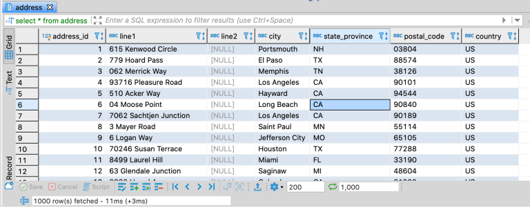
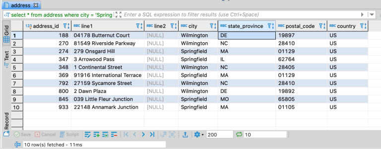
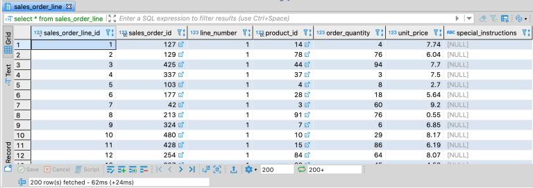

CRUD is an acronym for create, read, update, and delete.  Given you already have a sample database populated with data,
let's start with some simple reads using the select statement.  A simple select statement has the basic format of:

```sql
SELECT column1, column2, …
  FROM some_table;
```

Or to select all columns, use simply:

```sql
SELECT *
  FROM some_table;
```

Note the keywords are not case sensitive.

Now let's get our hands on some data.  Sticking with the "SQL for the Uninterested" theme, I'm going do give a lot of examples with a minimal amount of theory and rules. We'll start with a simple select of all rows, all columns from the address table.

```sql
select *
  from address;
```


<figcaption align="center">

*You may need to keep scrolling to the end of your result set to get a complete row count, depending on which SQL editor you're using.*

</figcaption>

You should have 1000 rows returned when you execute that query.  If you wanted just city, state, and zip code from the address table, then run:

```sql
select city,
       state_province,
       postal_code
  from address;
```

Now maybe we don't want to look at all the addresses.  This is where the "where" clause comes into play.  Say we wanted to just look at addresses for the state of North Carolina.  We could write that SQL statement as:

```sql
select *
  from address
 where state_province = 'NC';
```

You should now have just 26 rows returned.  Now what if you wanted to narrow that list down even further and look for only addresses in the city of Wilmington, NC?  You could 'and' those criteria together and write:

```sql
select *
  from address
 where city = 'Wilmington'
   and state_province = 'NC';
```

You now see there are 5 rows returned.

Just like you can use multiple conditions in your WHERE clause by using the AND keyword, you can also use the OR keyword.  Let's start off by finding addresses in the city of Wilmington or Springfield.

```sql
select *
  from address
 where city = 'Wilmington'
    or city = 'Springfield';
```


<figcaption align="center">

*Addresses in cities named Wilmington or Springfield*

</figcaption>

You'll see we now have 10 rows returned.  You'll also notice there are addresses for Wilmington in DE and in NC.  There are also addresses for Springfield in IL, MA, and MO.  Let's say now you wanted to narrow the results to Springfield in IL and MO.  Maybe you're thinking we can just combine both AND and OR in something like this:

```sql
select *
  from address
 where city = 'Springfield'
   and state_province = 'IL'
    or state_province = 'MO';
```

*Hmm*, looking at the results, you'll see 21 rows returned and notice addresses in cities such as St. Louis, Kansas City, Jefferson City, and Independence, MO.  It looks like that query was interpreted as addresses in Springfield, IL or addresses in MO.  Never fear! It will be easy enough to more clearly express our intent using some parentheses.  Let's try this:

```sql
select *
  from address
 where city = 'Springfield'
   and (state_province = 'IL' or state_province = 'MO');
```

That looks much better! We get just the two rows we wanted in the results.  Since we are OR'ing values in the same field, we can also rewrite that using an IN keyword, like this:

```sql
select *
  from address
 where city = 'Springfield'
   and state_province in ('IL', 'MO');
```

Just for practice, let's write a query that returns addresses in Springfield in MO, IL, or in the 01105 zip code.

```sql
select *
  from address
 where city = 'Springfield'
   and (state_province in ('IL', 'MO') or postal_code = '01105');
```

Looking at the results, for our data all we did with the above query is filter the two addresses in Springfield, MA  01129.  So in this case, we can get the same results by simply writing and of the following:

```sql
select *
  from address
 where city = 'Springfield'
   and postal_code != '01129';

select *
  from address
 where city = 'Springfield'
   and postal_code <> '01129';

select *
  from address
 where city = 'Springfield'
   and postal_code not in ('01129');
```

Note that we can use a keyword 'not' in front of an in clause, but not in conjunction with an = operator.

## Wildcards

Now let's get some practice using wildcards.  There are two pieces to this.  First, use the 'like' operator.  Then use % to represent zero to many characters, or _ to represent a single character.  Let's look at a couple of examples. Using a wildcard at the end of the string, this query returns addresses with a city of Springfield, Spring Hill, and Spring

```sql
select *
  from address
 where city like 'Spring%';
```

Moving the wildcard to the front of the string, this query returns addresses with a city of Spring and Silver Spring.

```sql
select *
  from address
 where city like '%Spring';
```

By using a wildcard at both ends of the string, we can find addresses with a city of Springfield, Spring Hill, Spring, and Silver Spring, as well as Bonita Springs and Colorado Springs

```sql
select *
  from address
 where city like '%Spring%';
Using the 'like' keyword with a string that does not contain a wildcard only returns exact matches.

select *
  from address
 where city like 'Spring';
```

## Nulls

Now let's switch tables and discuss nulls.  Null is the absence of a value.  It is not equal to anything, and it is not not equal
to anything.  It is not zero and it is not an empty string.  To test this, let's start by querying all data from the
sales_order_line table (762 rows).  You'll see the special_instructions field contains null in most rows.

```sql
select * from sales_order_line;
```


<figcaption align="center">

*DBeaver displaying null values in the sales_order_line table*

</figcaption>

Now, if we try to use null with any of the comparison operators we've already seen, we can see that none of the following will
return any rows!

```sql
select *
  from sales_order_line
 where special_instructions != null;

select *
  from sales_order_line
 where special_instructions = null;

select *
  from sales_order_line
 where null = null;
```

So how do we return rows that contain null? That requires the use of 'is null' or 'is not null'.

```sql
select *
  from sales_order_line
 where special_instructions is null;
-- returns (712 rows)

select *
  from sales_order_line
 where special_instructions is not null;
-- returns (50 rows)

select *
  from sales_order_line
 where special_instructions is not null
   and unit_price < 1;
-- returns (3 rows)
```

## Up next

Well, that's a descent overview of the select, from, and where clauses of the select statement. In the next entry,
we'll start covering sorting, grouping, and summarizing data. After that we'll get into how to join multiple tables in
a single query. And I haven't forgotten about the create, update, and delete parts of CRUD. We'll be covering those as insert,
update, and delete statements in a future post. If there are any questions about the basic select statements we've covered so
far, please let me know in the comments below.