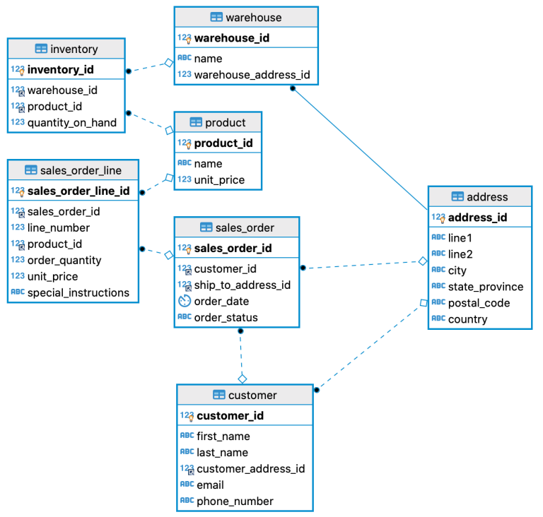

Ok, so maybe you’re not totally uninterested in SQL if you’re reading this.  But your true passion lies in something else, like working on your hot new javascript project or whatever, and you really just need to brush up on a little SQL to knock out a quick task and then get back to the work you really love.  If this describes you, the SQL for the Uninterested series was written for you.  It’s intended to give you a good foundation for routine tasks, and not intended to take you from SQL newb to SQL master.

To make it easier to get your hands on and start learning, I’ve made a few docker images that will quickly allow you to try out a few different database flavors without having to install and manage a database.  When learning something new, often the time involved with getting all the tools set up before you can really dig into the material can be a barrier to entry.  The goal here is to lower that bar as much as possible. The docker images come already populated with data which we’ll be using throughout this series.  Assuming you already have docker installed, you can run the following from your command line. We’re going to assume you’re going to use ‘sampleDB’ as your container name, but feel free to use whatever name you like.

For maria db:
```
docker pull bhnat/sampledb-maria:latest
docker container create -p 3306:3306 —-name sampleDB bhnat/sampledb-maria:latest
```
For mysql:
```
docker pull bhnat/sampledb-mysql:latest
docker container create -p 3306:3306 —-name sampleDB bhnat/sampledb-mysql:latest
```
If for some reason you already have something listening on port 3306, you can map a different port on your machine to port 3306 on your container. For example, say you wanted to use port 3316 on your local machine. You would then change the port mapping to -p 3316:3306 when running “docker container create.”

Once you have your container created, you can start it by running:
```
docker container start sampleDB
```
When you’re doing with the database and want to shut it down, you can run:
```
docker container stop sampleDB
```
You can start the container again, and any changes you may have made will still be there when you start the container again. If you want to delete the container, run:
```
docker container rm sampleDB
```
If you wanted to reset your database back to the initial state, but delete the container and then create it again from the image.

In case you aren’t running docker and do want to install and create the databases yourself, you can find a copy of the scripts on [github](https://github.com/dumpsterfireproject/sql-for-the-uninterested).

You can use whichever SQL client you prefer that is compatible with the database flavor you have chosen.  I have to work with multiple database flavors on a regular basis and don’t want to keep switching tools, so I use DBeaver, a “universal database client.”  The community edition can be downloaded from https://dbeaver.io, and the enterprise edition can be found at https://dbeaver.com.  The community edition will be fine to get you through this series.

Once you’ve connected to the sample database, you’ll see the tables for the following schema. You can connect using the user/password of luke/skywalker.



<figcaption align="center">

*Sample DB Entity Relationship Diagram (ERD)*

</figcaption>

The data in the table has been generated by [Mockaroo](https://mockaroo.com/) with a little [Hipster Ipsum](https://hipsum.co/) thrown in for good measure.

With all that said, let’s get to writing some SQL! In the next post, we’ll start with some basic select statements.

Note: If using a mysql 8+ JDBC driver (e.g., when using DBeaver), if you get an error message, “Public Key Retrieval is not allowed,” use the option “allowPublicKeyRetrieval=true”.
