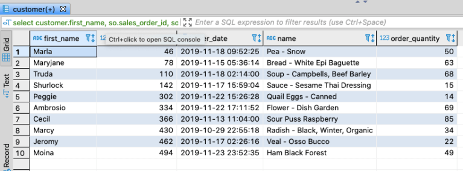
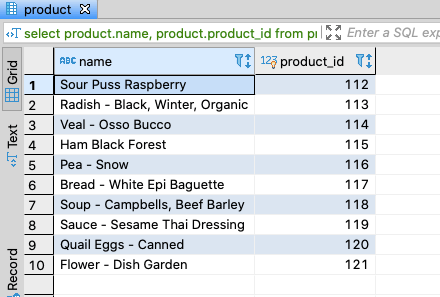

Continuing with the sample database available via the docker images from the [first post](../sql-for-the-uninterested) in this series, let's look at some
examples demonstrating the syntax of subqueries. A subquery is where you have a select statement nested inside of another query.
You might utilize this approach based on performance tuning, the readability of your queries, or out of necessity based on your
database schemas. A discussion of performance tuning is out of scope of this post. If you're curious about knowing when you
should or should not use a subquery based on performance tuning, search for 'explain statements' for your database. MySQL,
Maria, and SQL Server use the general syntax of 'EXPLAIN &lt;your query here&gt;' and there is plenty of documentation on Oracle's
Explain Plan. In short, explain produces an execution plan for your SQL statement which will tell you which indexes are being
used to fetch the data from each table, how much data is being fetched from each table, etc., so you can compare different
approaches to produce the same result set or trouble shoot a slow running query. But for this post, we're going to just focus
on the syntax of subqueries.

## Subqueries In A Where Clause

You can use a subquery in a where clause to filter the data returned. This often involves using "exists" or "not exists"
keywords. For example, I could use left joins to produce a list of the products in my catalog where we do not have inventory on
hand currently.
```sql
select product.name,
       product.product_id
  from product
  left join inventory on inventory.product_id = product.product_id
 where inventory.product_id is null;
```
I could also get the same results using a subquery looking for product where there does not exist any inventory using a 'not exists'
condition.
```sql
select name,
       product_id
  from product
 where not exists (select 1
                     from inventory
                    where inventory.product_id = product.product_id);
```

<figcaption align="center">

*Products with no inventory on hand*

</figcaption>
The data in the select statement of the subquery when used in a where clause is not available in the select statement, so I
chose to simply select a constant to keep is concise. I could also use any of the comparison operators in the where clause,
such as in, not in, =, >, etc. For example, the following query produces the same results as the previous two examples.
```sql
select name,
       product_id
  from product
 where product_id not in (select product_id
                            from inventory
                           where inventory.product_id);
```
When using a comparison operator against a subquery in the a where clause, the subquery must contain exactly one column in its
select clause. In the example above, that column is the product_id from the inventory table. Since the subquery above produces
multiple rows, I can use it with the 'in' or 'not in' keywords. If I were to use a comparison operator such as =, >, !=, etc.
that required a single value, my subquery must include a single column in the select and produce just a single row in it's
result set. If I changed the 'not in' to an = in the above query, I would get an error stating, "Subquery returns more than 1 row."
Purely for the sake of example, when the subquery returns one row as in the below example, we have valid syntax.
```sql
 select name,
        product_id
   from product
  where product_id = (select product_id
                        from inventory
                       where inventory.product_id
                         and inventory.product_id = 51
                         and inventory.warehouse_id = 1);
```
## Subqueries In A Select Clause

You can also include subqueries in select clauses. When doing so, the subquery in the select statement must produce a single row
for each row in the result set of the overall query. If your subquery returns more than one row, you'll get the "Subquery returns
more than 1 row" error. I've added a subquery to the select clause to one of our previous examples to provide an example.
```sql
select product.name,
       product.product_id,
       (select sum(order_quantity)
          from sales_order_line as sol
         where sol.product_id = product.product_id) as backorder_quantity
  from product
 where not exists (select 1
                     from inventory
                    where inventory.product_id = product.product_id);
```
## Subqueries In A From Clause

In this example, we're going to get the ordered quantity for which we don't have any inventory on hand, the back ordered
quantities. We could use left joins as follows.
```sql
select customer.first_name,
       so.sales_order_id,
       so.order_date,
       product.name,
       sol.order_quantity
  from sales_order as so
  join customer on customer.customer_id = so.customer_id
  join sales_order_line as sol on sol.sales_order_id = so.sales_order_id
  join product on product.product_id = sol.product_id
  left join inventory on inventory.product_id = product.product_id
 where inventory.product_id is null;
```

<figcaption align="center">

*Back order quantities*

</figcaption>
We could also get the same results using a subquery in the from clause, as follows.
```sql
select customer.first_name,
       so.sales_order_id,
       so.order_date,
       backorder_query.name,
       backorder_query.order_quantity
  from sales_order as so
  join customer on customer.customer_id = so.customer_id
  join (select sol.sales_order_id,
               sol.order_quantity,
               product.name
          from sales_order_line as sol
          join product on product.product_id = sol.product_id
          left join inventory on inventory.product_id = product.product_id
         where inventory.product_id is null) as backorder_query
    on backorder_query.sales_order_id = so.sales_order_id
```
## Up Next

A quick example of some unions, and then we'll circle back for inserts, updates, and deletes.