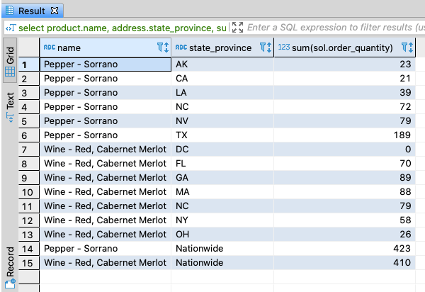
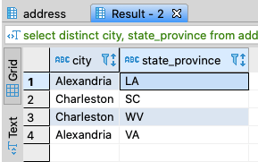
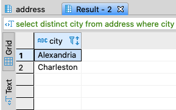
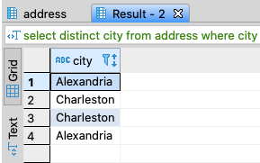

Again using the sample database available via the docker images from the [first post](../sql-for-the-uninterested) in this series,
lets cover unions. When using a union, you can combine results from two result sets into a single result set. This might be
useful during reporting, or having your application make one call to your database instead of multiple, avoiding what might be
an unnecessary round trip over the network to your database.

When using unions, the result sets from each query being combined has to have matching number and types of columns. That is, you
could not combine one result set that contains just a string and a decimal with another result set that is an two integers and a
string, for example. You can include null columns as placeholders to get the numbers and types of columns to match. For example,
say I wanted to include quantity ordered by state for certain products as well as products ordered nationwide for those same
products. I can union two queries together, using a placeholder in the second query where the first query lists the state.
```sql
select product.name,
       address.state_province,
       sum(sol.order_quantity)
  from sales_order as so
  join sales_order_line as sol on sol.sales_order_id = so.sales_order_id
  join product on product.product_id = sol.product_id
  join address on address.address_id = so.ship_to_address_id
 where product.product_id in (51,52)
 group by product.name,
       address.state_province
 union
select product.name,
       'Nationwide',
       sum(sol.order_quantity)
  from sales_order as so
  join sales_order_line as sol on sol.sales_order_id = so.sales_order_id
  join product on product.product_id = sol.product_id
 where product.product_id in (51,52)
 group by product.name
```

<figcaption align="center">

*Results from the union query*

</figcaption>

The other thing to note about unions is that duplicate records are not returned. If for some reason you need to include all
records from the union, you can use the 'union all' syntax. Consider the following queries.
```sql
select distinct city, state_province
  from address
 where city in ('Alexandria', 'Charleston')
   and state_province in ('LA', 'SC')
UNION 
select distinct city, state_province
  from address
 where city in ('Alexandria', 'Charleston')
   and state_province in ('WV', 'VA')
```

```sql
select distinct city
  from address
 where city in ('Alexandria', 'Charleston')
   and state_province in ('LA', 'SC')
UNION 
select distinct city
  from address
 where city in ('Alexandria', 'Charleston')
   and state_province in ('WV', 'VA')
```

```sql
select distinct city
  from address
 where city in ('Alexandria', 'Charleston')
   and state_province in ('LA', 'SC')
UNION ALL 
select distinct city
  from address
 where city in ('Alexandria', 'Charleston')
   and state_province in ('WV', 'VA')
```


In the first query, there are no duplicated rows, because the second column differentiates the results of the first select from
that of the second select. So the combined results contains 4 rows. In the second query, the same values are returned in both
select statements. Since we're using 'union', the duplicates are not returned and we only have two rows in the combined result
set. In the third query, using union all forces all rows to be returned without filtering out any duplicates. The combined
result set contains all 4 rows.

## Up Next

We'll cover insert, update, and delete statements.
